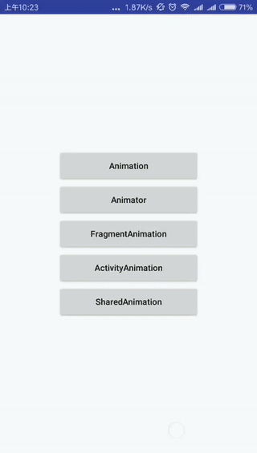
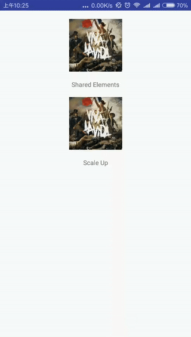

# Animator Sample

Android animation sample contains `animation` , `animator` , `fragment transition` , `activity transition` 

### Animation

Use `xml` or `Animation` subclass to implement effect rotate, transition, alpha and scale.

You can check code in `BaseAnimationActivity.class` .

### Animator

Also use `xml` or `ObjectAnimator` class to implement effect rotate, transition, alpha and scale.

### Fragment Transition

Use `transaction.setCustomAnimations(R.anim.slide_enter, R.anim.slide_exit, R.anim.slide_enter, R.anim.slide_exit);` to implement sliding effect.

**note:** invoke `transition.setCustomAnimation()` before `transition.add()` method, otherwise the transition will not perform sliding effect.

### Activity Transition

 Use `AcitivityOptionsCompact.makeSceneTransitionAnimation` to implement `fade` , `explode` , `slide` effect.

**note:** invoke `getWindow().requestFeature(Window.FEATURE_CONTENT_TRANSITIONS);` before `super.onCreate()` in both src activity and dst activity.

You can also check `SharedElements` in `SharedElementsActivity.class` .

Some other reference:

[https://github.com/yipianfengye/Android-activityAnim](https://github.com/yipianfengye/Android-activityAnim)

